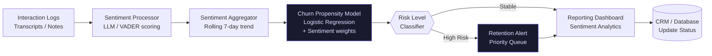

# CX Sentiment & Churn Sentinel

> **Status: building attempt.** The sentiment-scoring and churn-propensity stages
> run on the sample interaction data included in the repository. The business-impact
> figures in this file have no recorded method, baseline, or sample, so they are
> presented below as historical project context, not as measured results. Snapshot
> 2026-06-02.

One of the four building attempts from May–June 2026 — the period when I left a
twenty-eight-year operations career and started building full time, alone, while
teaching myself to write software. The thinking here was later absorbed into
Helix Prime.

## What it does

Monitors support interactions, scores sentiment, and scores churn risk, so that
at-risk accounts can reach a retention queue before they leave. It reads
interaction logs (transcripts or notes), aggregates sentiment over a rolling
window, and combines that signal with a churn-propensity model.

## Architecture overview

## What is verified, and what is not

| Item | Status |
|---|---|
| Sentiment scoring pipeline | Runs locally on the sample data. |
| Rolling sentiment aggregation | Runs locally. |
| Churn-propensity model | Logistic regression over sentiment-weighted features. Runs locally. |
| Churn, latency, throughput, and accuracy figures | Historical project context. No method, baseline, or sample is recorded. Not verifiable. |
| External audit | None. |

### Historical project context (unverified)

An earlier version of this file presented the figures below as measured business
impact. No baseline, sample, or method was ever recorded for any of them, so they
are reproduced here as the project's own historical claims and marked unverified.

| Claim | Figure | Status |
|---|---|---|
| Churn rate | ↓ 15–20% | Unverified historical claim |
| At-risk detection latency | 30+ days → <24 hrs (↓ 95%) | Unverified historical claim |
| Retention desk throughput | ↑ 40% | Unverified historical claim |
| Sentiment accuracy | "Verified" | Unverified historical claim. No accuracy measurement was recorded, so the word "Verified" has been removed. |

## Stack

| Component | Technology | Note |
|---|---|---|
| Sentiment analysis | Transformers / OpenAI | Chosen for nuance beyond keyword frequency |
| Prediction model | Scikit-learn | Interpretable classification for churn probability |
| Pipeline orchestration | Prefect | Retry and error handling for intermittent data feeds |
| Data storage | PostgreSQL | Relational storage for customer-sentiment time series |
| Dashboard | Streamlit | Iteration speed for the retention-team UI |

## Deployment

### Prerequisites

- Python 3.11+
- Access to a transcript or data source

### Local setup

    git clone https://github.com/HatemIsmailShalaby1979/cx-sentiment-sentinel.git
    cd cx-sentiment-sentinel
    pip install -r requirements.txt

### Run

    python src/ingestion_engine.py --source raw_logs/
    python src/sentiment_model.py --run-batch
    python src/churn_predictor.py --generate-alerts

## Security

A database credential was previously committed to this public repository in a
tracked `.env` file. The owner rotated the credential on 2026-09-25, and the file
was removed from the index and working tree. The decision is recorded in
`SECURITY_DECISIONS.md` (SD-001). A literal database password was also removed
from `docker-compose.yml` on the same date and is now read from the environment,
failing closed when the variable is absent.

The `.env` file remains reachable in git history. Purging that history is
outstanding. The residual exposure is information disclosure, not a live
credential: the database host, port, name, and username, plus the password
pattern. A purge runbook is recorded in the portfolio security audit.

## Honest boundary

It is a demonstration pipeline, not a deployed service. It does not connect to a
live CRM, telephony, or ticketing system; it reads files. The churn model is
trained and demonstrated on sample data and is not validated against a real
account population. It has no authentication and no access control.

This is not a production deployment claim. There is no external audit, no
certified data isolation, and no signed security review. No revenue has been
realised.

## The founder's story

I spent twenty-eight years in operations. The first fourteen were the
foundation: ground operations and real-time traffic management at Hurghada
International Airport, then Air Berlin, where I directed ground operations
through the 2011 regional transition and held SLA compliance under conditions
that had no playbook. Alongside that, international logistics at Shorouk
International Bookshop and hybrid IT operations at Nefertari American School.

The second fourteen were about automation. I built AI-driven automation for
contact centres at ByteDance, Vodafone and Uber: NLP pipelines that turn
unstructured customer language into signal, Erlang C forecasting that turns
volume into staffing, and the reporting layers that made both usable by people
on the floor. The hard part was never the model. It was the handover — who owns
the decision, what evidence supports it, and what happens when the system is
wrong.

In April 2026 I left that career and started building full time — alone, and
teaching myself to write software as I went. The first four tools were published
six weeks later, in May and June 2026. Each one took a single operational problem
and solved it properly. They were not impressive. They were correct.

Those four tools converged into one idea: **Helix Codex**, an accountable AI
operating organization. Not an autonomous agent. An organization with a
constitution, named roles with bounded authority, evidence trails, and a human at
every consequential boundary. Helix Prime is its operations core.

CX Sentiment & Churn Sentinel is one of the four building attempts. It is
maintained by one person, with no team and no funding. It has not been externally
audited and it has not made revenue. Where it is unfinished, this document says
so.

## Related work

- [Helix Prime](https://github.com/HatemIsmailShalaby1979/Helix-Prime) — the operations core
- [Helix Education](https://github.com/HatemIsmailShalaby1979/Helix-Education) — event-sourced learning engine
- [Study Studio](https://github.com/HatemIsmailShalaby1979/Study-Studio) — local-first AI tutor
- [L&D Command Center](https://github.com/HatemIsmailShalaby1979/L-D-Command-Center) — desktop learning and career workstation
- [Blue Waves](https://github.com/HatemIsmailShalaby1979/Blue-Waves-) — content studio
- [LIVE Support Assistant](https://github.com/HatemIsmailShalaby1979/LIVE-Support-Assistant) — explainable support prototype
- [Full portfolio](https://github.com/HatemIsmailShalaby1979) — the front door

### The 2026 building attempts

- [WFM Forecasting Calculator](https://github.com/HatemIsmailShalaby1979/wfm-forecasting-calculator)
- [RTA Command Center](https://github.com/HatemIsmailShalaby1979/RTA_command_center)
- [Dynamic Ops Automation Engine](https://github.com/HatemIsmailShalaby1979/Dynamic-Ops-Automation-Engine)

## Author

**Hatem Ismail Shalaby** — Operations Architect · AI Systems Engineer · Founder

- GitHub: [HatemIsmailShalaby1979](https://github.com/HatemIsmailShalaby1979)
- LinkedIn: [hatem-shalaby-202902127](https://www.linkedin.com/in/hatem-shalaby-202902127/)
- Email: hatemshalaby2025@gmail.com
- Education: BSc Managerial Sciences (Computer Section), Sadat Academy for Management Sciences; Business Analytics Nanodegree, Udacity

Based in Al Obour City, Al-Qalyubia Governorate, Egypt.

## Licence

MIT
