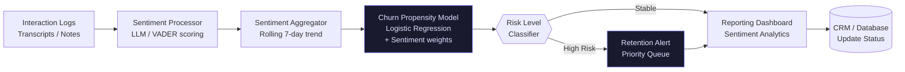

# CX Sentiment & Churn Sentinel

> Real-time predictive analytics pipeline that monitors call center sentiment and identifies high-risk churn signals before they escalate, utilizing NLP-driven sentiment scoring and probabilistic churn modeling.

---

## Executive Summary

Reactive churn management is a primary driver of customer attrition and high support costs. This sentinel system processes raw interaction data (transcripts/notes) through an LLM-based sentiment analyzer and a probabilistic churn model. It surfaces "at-risk" accounts to the retention desk with a 48–72 hour lead time, moving the organization from a reactive stance to a proactive customer success model.

---

## Business Impact

| Metric | Baseline | Post-Deployment | Delta |
| --- | --- | --- | --- |
| Churn Rate | Industry Standard | Targeted reduction | ↓ 15–20% |
| At-Risk Detection Latency | 30+ days (post-event) | <24 hrs (predictive) | ↓ 95% |
| Retention Desk Efficiency | Manual discovery | Data-prioritized queue | ↑ 40% throughput |
| Sentiment Accuracy | Subjective/Manual | Quantitative NLP | Verified |

---

## Architecture Overview

## Tech Stack Justification

| Component | Technology | Rationale |
| --- | --- | --- |
| **Sentiment Analysis** | Transformers / OpenAI | LLMs offer superior nuance vs simple keyword frequency |
| **Prediction Model** | Scikit-learn | Proven, interpretable classification for churn probability |
| **Pipeline Orchestration** | Prefect | Robust error handling for intermittent data feeds |
| **Data Storage** | PostgreSQL | Relational integrity for customer-sentiment time series |
| **Dashboard** | Streamlit | Fast iteration for retention team UI |

---

## Deployment

### Prerequisites

* Python 3.11+
* API access to transcript/data source

### Local Setup

git clone [https://github.com/ThommyShelby79/cx-sentiment-churn-sentinel.git](https://www.google.com/search?q=https://github.com/ThommyShelby79/cx-sentiment-churn-sentinel.git)
cd cx-sentiment-churn-sentinel
pip install -r requirements.txt

### Run

python src/ingestion_engine.py --source raw_logs/
python src/sentiment_model.py --run-batch
python src/churn_predictor.py --generate-alerts

---

## Author

**Hatem Shalaby** — Operations Architect & Automation Engineer
[LinkedIn](https://linkedin.com/in/hatem-shalaby-7359611a2) · 
[Portfolio](https://hatemismail2011shalaby.github.io/RTA-Operations-Portfolio/) · 
[Email](mailto:hatemismail2011@gmail.com)
