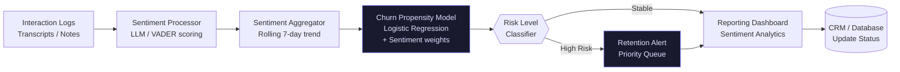

# CX Sentiment & Churn Sentinel

> **Status: building attempt.** The sentiment-scoring and churn-propensity stages
> run on the sample interaction data included in the repository. The business-impact
> figures in this file have no recorded method, baseline, or sample, so they are
> presented below as historical project context, not as measured results. Snapshot
> 2026-06-02.

A precursor to Helix Prime, from the May–June 2026 build period. The thinking
here was later absorbed into Helix Prime.

## What it does

Monitors support interactions, scores sentiment, and scores churn risk, so that
at-risk accounts can reach a retention queue before they leave. It reads
interaction logs (transcripts or notes), aggregates sentiment over a rolling
window, and combines that signal with a churn-propensity model.

## Architecture overview

## What is verified, and what is not

| Item | Status |
|---|---|
| Sentiment scoring pipeline | Runs locally on the sample data. |
| Rolling sentiment aggregation | Runs locally. |
| Churn-propensity model | Logistic regression over sentiment-weighted features. Runs locally. |
| Churn, latency, throughput, and accuracy figures | Historical project context. No method, baseline, or sample is recorded. Not verifiable. |
| External audit | None. |

### Historical project context (unverified)

An earlier version of this file presented the figures below as measured business
impact. No baseline, sample, or method was ever recorded for any of them, so they
are reproduced here as the project's own historical claims and marked unverified.

| Claim | Figure | Status |
|---|---|---|
| Churn rate | ↓ 15–20% | Unverified historical claim |
| At-risk detection latency | 30+ days → <24 hrs (↓ 95%) | Unverified historical claim |
| Retention desk throughput | ↑ 40% | Unverified historical claim |
| Sentiment accuracy | "Verified" | Unverified historical claim. No accuracy measurement was recorded, so the word "Verified" has been removed. |

## Stack

| Component | Technology | Note |
|---|---|---|
| Sentiment analysis | Transformers / OpenAI | Chosen for nuance beyond keyword frequency |
| Prediction model | Scikit-learn | Interpretable classification for churn probability |
| Pipeline orchestration | Prefect | Retry and error handling for intermittent data feeds |
| Data storage | PostgreSQL | Relational storage for customer-sentiment time series |
| Dashboard | Streamlit | Iteration speed for the retention-team UI |

## Deployment

### Prerequisites

- Python 3.11+
- Access to a transcript or data source

### Local setup

    git clone https://github.com/HatemIsmailShalaby1979/cx-sentiment-sentinel.git
    cd cx-sentiment-sentinel
    pip install -r requirements.txt

### Run

    python src/ingestion_engine.py --source raw_logs/
    python src/sentiment_model.py --run-batch
    python src/churn_predictor.py --generate-alerts

## Security

This repository had a credential committed to it in its early history. It has been
rotated, removed, and purged from the git history. Configuration is now read from
the environment, and `docker-compose.yml` fails closed when a required variable is
absent. The full record is in `SECURITY_DECISIONS.md`.

## Honest boundary

It is a demonstration pipeline, not a deployed service. It does not connect to a
live CRM, telephony, or ticketing system; it reads files. The churn model is
trained and demonstrated on sample data and is not validated against a real
account population. It has no authentication and no access control.

This is not a production deployment claim. There is no external audit, no
certified data isolation, and no signed security review. No revenue has been
realised.

## Related work

- [Helix Prime](https://github.com/HatemIsmailShalaby1979/Helix-Prime) — the operations core
- [Helix Education](https://github.com/HatemIsmailShalaby1979/Helix-Education) — event-sourced learning engine
- [Study Studio](https://github.com/HatemIsmailShalaby1979/Study-Studio) — local-first AI tutor
- [L&D Command Center](https://github.com/HatemIsmailShalaby1979/L-D-Command-Center) — desktop learning and career workstation
- [Blue Waves](https://github.com/HatemIsmailShalaby1979/Blue-Waves-) — content studio
- [LIVE Support Assistant](https://github.com/HatemIsmailShalaby1979/LIVE-Support-Assistant) — explainable support prototype
- [Full portfolio](https://github.com/HatemIsmailShalaby1979) — how this project fits the wider work

### The 2026 building attempts

- [WFM Forecasting Calculator](https://github.com/HatemIsmailShalaby1979/wfm-forecasting-calculator)
- [RTA Command Center](https://github.com/HatemIsmailShalaby1979/RTA_command_center)
- [Dynamic Ops Automation Engine](https://github.com/HatemIsmailShalaby1979/Dynamic-Ops-Automation-Engine)

## Author

**Hatem Ismail Shalaby** — Operations Architect · AI Systems Engineer · Founder

- GitHub: [HatemIsmailShalaby1979](https://github.com/HatemIsmailShalaby1979)
- LinkedIn: [hatem-shalaby-202902127](https://www.linkedin.com/in/hatem-shalaby-202902127/)
- Email: hatemshalaby2025@gmail.com
- Education: BSc Managerial Sciences (Computer Section), Sadat Academy for Management Sciences; Business Analytics Nanodegree, Udacity

Based in Al Obour City, Al-Qalyubia Governorate, Egypt.

## Licence

MIT
